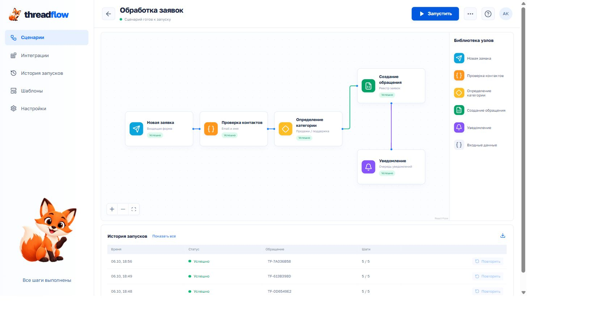

# Threadflow

Executable workflow canvas with durable step results, retries and idempotent business effects.



[Validation notes](docs/VALIDATION.md) · [Source license](LICENSE)

## What it does

Форма - проверка контактов - категория - обращение в SQLite - локальный outbox. Повтор сбойного шага не создаёт дублей.

Form - validation - rule classification - SQLite ticket - local notification outbox. Failed steps resume without duplicating tickets.

Independent portfolio demo, written from scratch. Synthetic examples only. No commercial source, proprietary prompts, client recordings or customer data.

## Run locally

Python 3.12, Node 22 and pnpm 11.19.0:

```sh
python -m venv .venv
# Windows: .venv\Scripts\activate
# Linux/macOS: source .venv/bin/activate
pip install -r requirements.txt
pnpm install --frozen-lockfile
pnpm build
uvicorn backend.app:app --host 127.0.0.1 --port 8000
```

Open http://127.0.0.1:8000. For UI development: `pnpm dev` (API proxy expects port 8000).

```sh
docker compose up --build
```

Local-only binding is deliberate. These demos have no user authentication and are not hardened multi-user hosted services.

## Checks and delivery

```sh
pip install pytest httpx
pytest -q
pnpm build
```

GitHub Actions runs backend checks, TypeScript/build checks and Docker image build. Model credentials are never included in CI or a public image.

## Boundaries

Порядок обработки фиксирован. Холст позволяет перемещать блоки. Внешняя доставка уведомлений не настроена.

The full application runs locally with its Python backend. A static build alone cannot transcribe audio, execute workflows, render video or call Codex.

## Stack and attribution

Python / FastAPI / React / TypeScript / Vite / Motion / Lucide. React Flow powers the editable workflow canvas. Google Fonts: Golos Text (SIL OFL). All third-party dependencies retain their own licenses. See `THIRD_PARTY.md`.

MIT for independently authored source. Asset provenance and actual validation: `docs/VALIDATION.md`.
